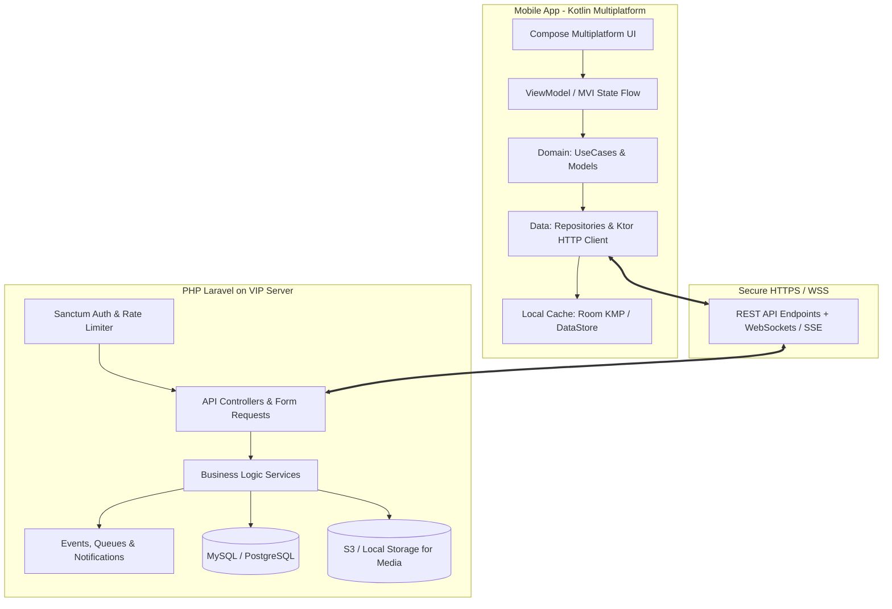
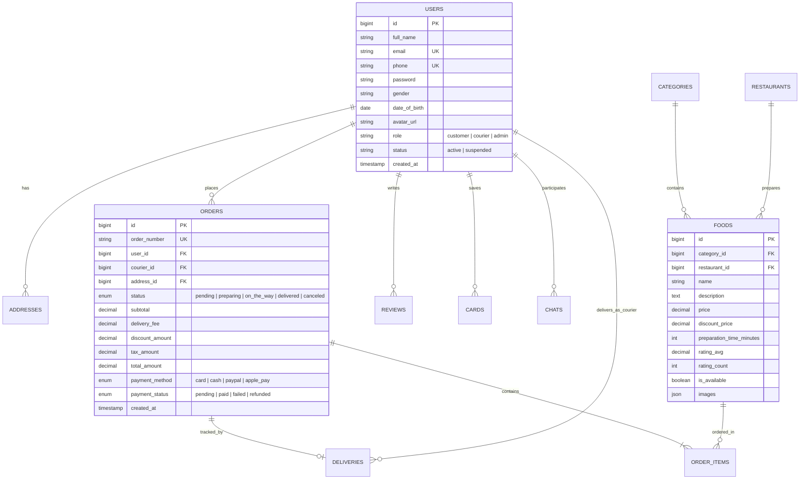

# 🍔 Food Delivery App — To'liq Tizim Arxitekturasi va Yo'l Xaritasi (Roadmap)

Ushbu hujjat **Food Delivery App** loyihasini noldan to'liq ishga tushirishgacha bo'lgan arxitekturaviy yechim, ma'lumotlar bazasi tuzilishi, backend (PHP Laravel REST API), mobil ilova (Kotlin Multiplatform / Compose Multiplatform) va ularni birlashtirish rejasini qamrab oladi.

---

## 🏗️ 1. Loyihaning Umumiy Tizim Arxitekturasi

Loyiha ikkita asosiy mustaqil qismdan iborat bo'ladi:
1. **`backend/` (PHP Laravel REST API):** Server tomoni. Mavjud VIP serverdagi boshqa loyihalarga xalaqit bermaydigan, xavfsiz, yuqori tezlikdagi REST API.
2. **`mobile/` (Kotlin Multiplatform + Compose Multiplatform):** Android va kelajakda iOS uchun yagona umumiy kod bazasi (Shared Business Logic + Shared UI). Windows operatsion tizimida Android emulyatori va qurilmalari uchun to'liq yig'iladi va ishlaydi.

---

## 🛠️ 2. Texnologik Stack (Senior Architecture Choice)

### A. Mobil Ilova (Mobile Client)
* **Til & Freymvork:** Kotlin 2.x, Compose Multiplatform (Desktop/Android/iOS qo'llab-quvvatlaydi).
* **Arxitektura:** Clean Architecture (Domain Layer, Data Layer, Presentation Layer) + **MVI / MVVM** pattern.
* **Asosiy kutubxonalar:**
  * **Tarmoq (Networking):** `Ktor Client` (OkHttp engine for Android, Darwin for iOS) + `kotlinx.serialization.json`.
  * **DI (Dependency Injection):** `Koin` (Multiplatform).
  * **Navigatsiya:** `Voyager` yoki `Jetpack Navigation Compose KMP`.
  * **Rasmlarni yuklash:** `Coil 3 Multiplatform`.
  * **Lokal kesh & Sessiyalar:** `Multiplatform Settings` / `DataStore KMP` / `Room KMP`.
  * **Xaritalar (Map):** Android uchun Google Maps / MapLibre KMP integratsiyasi.
  * **Asinxronlik:** `Kotlin Coroutines` & `StateFlow` / `SharedFlow`.

### B. Backend API (Server)
* **Til & Freymvork:** PHP 8.2+, Laravel 11.x (REST API).
* **Autentifikatsiya:** Laravel Sanctum (Token-based SPA & Mobile API tokens) + 2FA / OTP xizmati.
* **Ma'lumotlar bazasi:** MySQL 8.0+ / PostgreSQL (Tranzaksiyalar, Spatial indekslar masofani hisoblash uchun).
* **Real-time aloqa:** Pusher / Laravel Reverb / WebSockets (Chat va Jonli kurer lokatsiyasi uchun).
* **Bildirishnomalar (Push Notifications):** Firebase Cloud Messaging (FCM).
* **Media boshqaruvi:** Spatie Media Library yoki Laravel Storage (Taomlar rasmlari va avatarlar uchun).

---

## 🗄️ 3. Ma'lumotlar Bazasi Sxemasi (Database Schema)

### Qo'shimcha Jadvallar:
1. `categories` (id, name, icon_url, order_index, is_active)
2. `order_items` (id, order_id, food_id, quantity, unit_price, total_price, special_instructions)
3. `user_addresses` (id, user_id, label, address_line, house_number, city, latitude, longitude, is_default)
4. `saved_cards` (id, user_id, card_holder_name, last_four, brand, token, expiry_date, is_default)
5. `notifications` (id, user_id, title, body, type, is_read, meta_data, created_at)
6. `chats` & `messages` (id, sender_id, receiver_id, order_id, message, media_url, is_read, sent_at)
7. `deliveries` (id, order_id, courier_id, current_latitude, current_longitude, status, updated_at)

---

## 📡 4. REST API Endpointlar Ro'yxati (API Specifications)

### 🔐 Auth & Xavfsizlik
* `POST /api/v1/auth/register` — Yangi foydalanuvchini ro'yxatdan o'tkazish
* `POST /api/v1/auth/login` — Email va parol bilan kirish (Token qaytaradi)
* `POST /api/v1/auth/forgot-password` — OTP kod so'rash (Email / WhatsApp)
* `POST /api/v1/auth/verify-otp` — 4 xonali OTP kodni tasdiqlash
* `POST /api/v1/auth/reset-password` — Yangi parol o'rnatish
* `POST /api/v1/auth/logout` — Tizimdan chiqish (Tokini bekor qilish)
* `POST /api/v1/auth/social-login` — Google / Apple orqali kirish

### 🍔 Taomlar va Menyu (Home & Catalog)
* `GET /api/v1/categories` — Barcha faol kategoriyalar ro'yxati
* `GET /api/v1/banners` — Reklama va chegirma bannerlari
* `GET /api/v1/foods` — Taomlar ro'yxati (filtrlar: kategoriya, qidiruv, narx, reyting, saralash)
* `GET /api/v1/foods/{id}` — Taomning batafsil sahifasi + Tavsiya etilgan taomlar
* `GET /api/v1/foods/popular` — Eng ko'p sotilgan taomlar

### 🔍 Qidiruv (Search)
* `GET /api/v1/search/suggestions` — Qidiruv avtomatik to'ldirish
* `GET /api/v1/search/history` — Foydalanuvchining so'nggi qidiruvlari
* `DELETE /api/v1/search/history` — Qidiruv tarixini tozalash

### 🛒 Savatcha va Buyurtmalar (Cart & Orders)
* `POST /api/v1/orders/calculate` — Buyurtma hisob-kitobi (Soliq, yetkazish narxi, promo-kod)
* `POST /api/v1/orders` — Yangi buyurtma yaratish (Checkout)
* `GET /api/v1/orders` — Foydalanuvchi buyurtmalari tarixi
* `GET /api/v1/orders/{id}` — Buyurtma tafsilotlari
* `POST /api/v1/orders/{id}/cancel` — Buyurtmani bekor qilish
* `GET /api/v1/orders/{id}/tracking` — Jonli kurer lokatsiyasi va yetkazish bosqichlari

### 💬 Chat va Aloqa (Chat & Call Signaling)
* `GET /api/v1/chats` — Xabarlar ro'yxati
* `GET /api/v1/chats/{order_id}/messages` — Kurer bilan yozishmalar
* `POST /api/v1/chats/{order_id}/messages` — Yangi xabar yuborish (matn/rasm)
* `POST /api/v1/chats/{order_id}/call-signal` — WebRTC / VoIP qo'ng'iroq signali

### 👤 Profil, Kartalar va Sozlamalar
* `GET /api/v1/profile` — Profil ma'lumotlari va faol buyurtma holati
* `PUT /api/v1/profile` — Profilni yangilash (Ism, telefon, jins, tug'ilgan sana, rasm)
* `GET /api/v1/cards` — Saqlangan to'lov kartalari
* `POST /api/v1/cards` — Yangi karta qo'shish
* `DELETE /api/v1/cards/{id}` — Kartani o'chirish
* `GET /api/v1/notifications` — Bildirishnomalar ro'yxati

---

## 🎨 5. Mobil Ilova UI Strukturasi (KMP Compose Multiplatform)

Skrinshotlardagi 8 ta asosiy modul bo'yicha komponentlar tuzilmasi:

1. **`feature-onboarding`**: `OnboardingScreen.kt`, `PagerIndicator.kt`, `OnboardingCard.kt`
2. **`feature-auth`**:
   * `LoginScreen.kt`, `RegisterScreen.kt`, `SocialAuthButtons.kt`
   * `ForgotPasswordSheet.kt`, `OtpVerificationScreen.kt`, `ResetPasswordScreen.kt`, `SuccessDialog.kt`
3. **`feature-home`**:
   * `HomeScreen.kt`, `LocationHeader.kt`, `PromoBannerCard.kt`, `CategoryBar.kt`, `FoodGridItem.kt`
4. **`feature-food-detail`**:
   * `FoodDetailScreen.kt`, `FoodImageSlider.kt`, `QuantityCounter.kt`, `RecommendedFoodCarousel.kt`
5. **`feature-search`**:
   * `SearchScreen.kt`, `SearchBarWithFilter.kt`, `RecentSearchChips.kt`, `EmptySearchResultView.kt`
6. **`feature-cart-order`**:
   * `CartScreen.kt`, `CartItemRow.kt`, `PromoCodeInput.kt`, `PaymentSummaryCard.kt`, `EmptyCartView.kt`
   * `PaymentAddressScreen.kt`, `OrderSuccessScreen.kt`
7. **`feature-tracking`**:
   * `DeliveryTrackingScreen.kt`, `DeliveryMapOverlay.kt`, `CourierInfoCard.kt`, `DeliveryStepper.kt`
8. **`feature-chat`**:
   * `ChatListScreen.kt`, `ChatScreen.kt`, `MessageBubble.kt`, `AudioCallScreen.kt`
9. **`feature-profile-settings`**:
   * `ProfileScreen.kt`, `PersonalDataScreen.kt`, `SettingsScreen.kt`, `LanguageModal.kt`, `CardsScreen.kt`, `AddCardSheet.kt`, `HelpCenterScreen.kt`

---

## 🚀 6. Bosqichma-bosqich Bajarish Yo'l Xaritasi (Implementation Roadmap)

### 🔹 1-Bosqich: Loyiha Poydevorini Yaratish (Foundation & Architecture)
1. Monorepo tuzilishini tashkil qilish: `backend/` (Laravel) va `mobile/` (Kotlin Multiplatform).
2. KMP loyihasini Compose Multiplatform bilan sozlash (Gradle dependencies, Koin, Ktor, Coil, Navigation).
3. UI Design System (Ranglar palitrasi, Typography, Buttonlar, Inputlar, Dialoglar, BottomSheetlar).

### 🔹 2-Bosqich: Backend API va Ma'lumotlar Bazasi (Backend Core)
1. Laravel loyihasini sozlash, Migratsiyalar, Modellar va Factory/Seederlarni yaratish (Barcha taomlar, kategoriyalar, kurerlar uchun sinov ma'lumotlari).
2. Sanctum asosidagi Auth API (Register, Login, OTP, Reset Password).
3. Resurslar (Resources) va Request Validatsiyalarini tayyorlash.

### 🔹 3-Bosqich: Mobil Ilovada Autentifikatsiya va Onboarding UI
1. Onboarding slayderi va animatsiyalari.
2. Login, Register, Forgot Password, OTP kod kiritish va parolni yangilash ekranlari.
3. Ktor Client orqali Backend Auth API bilan integratsiya qilish va JWT tokenlarni lokal saqlash.

### 🔹 4-Bosqich: Asosiy Menyu, Qidiruv va Taom Sahifalari (Home, Search, Details)
1. Home sahifasi: Kategoriya filtri, Aksiya bannerlari, Taomlar gridi.
2. Qidiruv sahifasi: Real-time qidiruv, Qidiruv tarixi, Topilmadi holati (Empty State).
3. Taom detallari sahifasi: Rasmlar karuseli, Miqdorni boshqarish (`+/-`), Tavsiya etilgan taomlar.

### 🔹 5-Bosqich: Savatcha, Buyurtma Berish va Jonli Kuzatuv (Cart, Checkout & Tracking)
1. Savatcha boshqaruvi (Local State & Remote Sync).
2. Promo kod qo'llash, yetkazib berish manzili va to'lov usulini tanlash.
3. Buyurtma berilgach Kurer kuzatuvi ekrani (Xarita marshruti, Kurer kartasi, Stepper).

### 🔹 6-Bosqich: Chat, Ovozli Qo'ng'iroq va Profil/Sozlamalar
1. Kurer bilan real-time chat oynasi va Audio qo'ng'iroq UI.
2. Profil sahifasi, Shaxsiy ma'lumotlarni tahrirlash, Tilni tanlash modali.
3. Kartalarni boshqarish (Virtual karta dizayni, yangi karta qo'shish, o'chirish).

### 🔹 7-Bosqich: Testlash, VIP Serverga Joylash va Yakuniy Sayqallash
1. API testlari (Postman / Pest / PHPUnit).
2. Mobil ilovaning Android buildini tekshirish (APK / AAB).
3. iOS uchun mos kod bazasini tekshirish (macOS ga ko'chirilganda darhol ishga tushadigan arxitektura).
4. VIP serverga yuklash bo'yicha qo'llanma va integratsiya.

---

## 🔒 7. Xavfsizlik va Ishlash Samaradorligi (Senior Best Practices)
* **Xavfsizlik:** SQL Injection, XSS, CSRF himoyasi, Parollarni bcrypt/argon2 bilan shifrlash, API Rate Limiting (Brute-force hujumlariga qarshi).
* **Tezlik:** API javoblarini keshlashtirish (Redis), Rasmlarni optimallashtirish (WebP format, KMP Coil kesh), Offline-first arxitektura (foydalanuvchi ma'lumotlari keshda saqlanadi).

---

## 📋 8. Foydalanuvchi Tasdig'i (User Review)

Ushbu arxitekturaviy reja ma'qulmi? Tasdiqlasangiz, darhol **1-Bosqich** (Loyiha strukturasini yaratish, KMP va Laravel sozlamalari)dan amaliy ishga kirishamiz!
